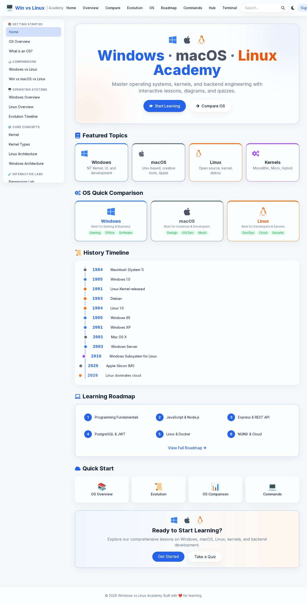
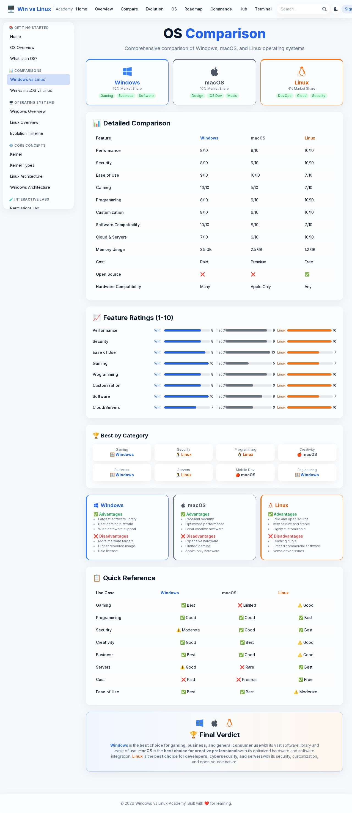
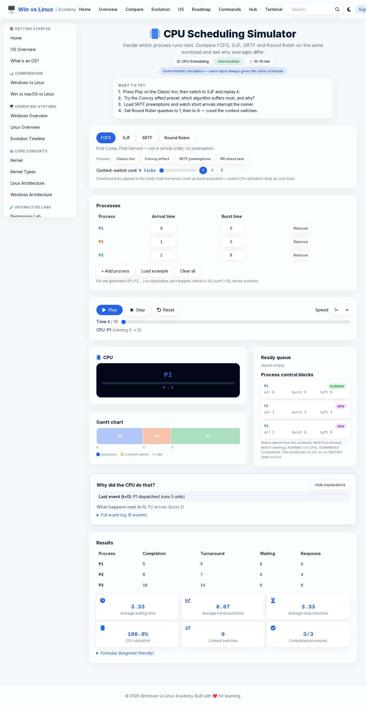
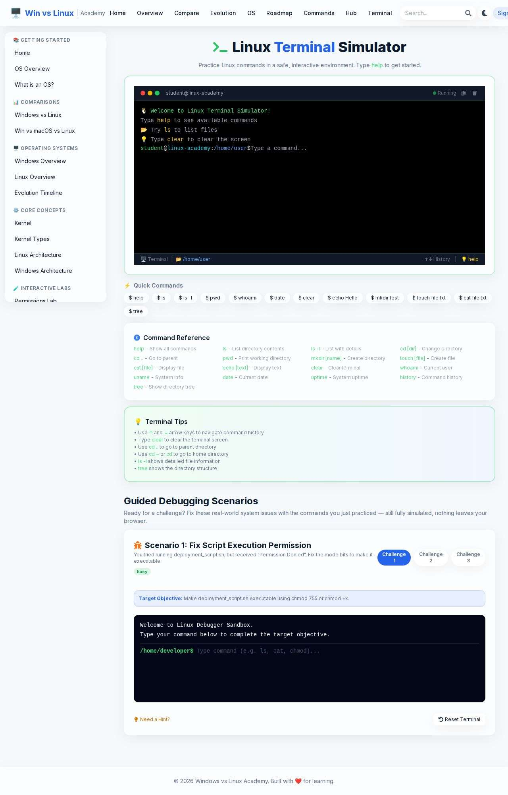
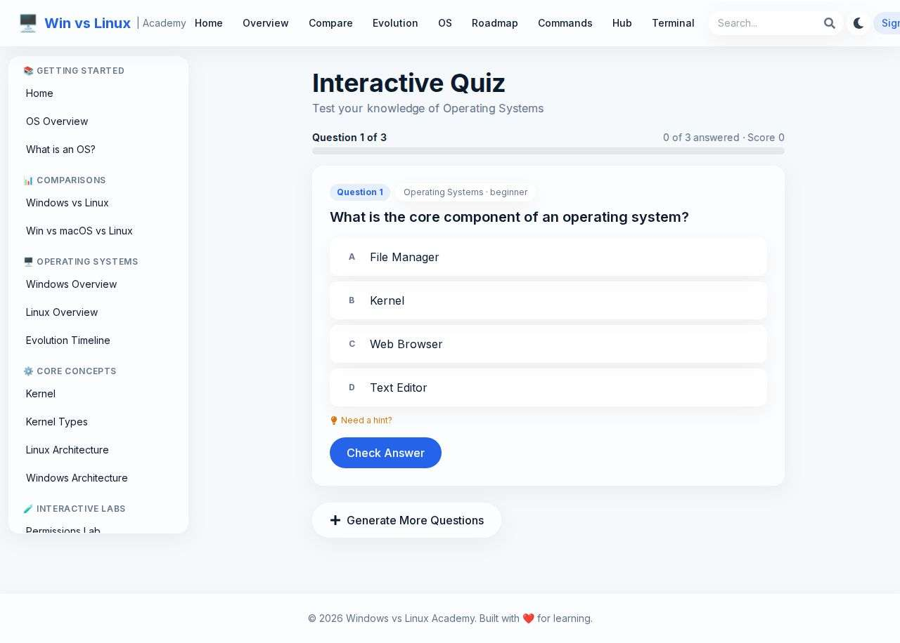
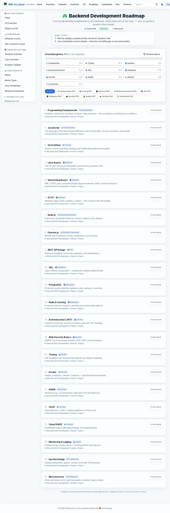
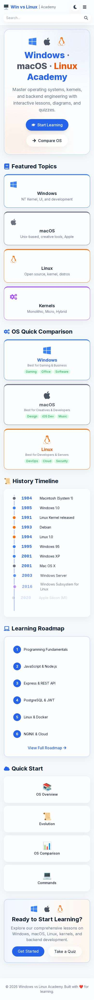
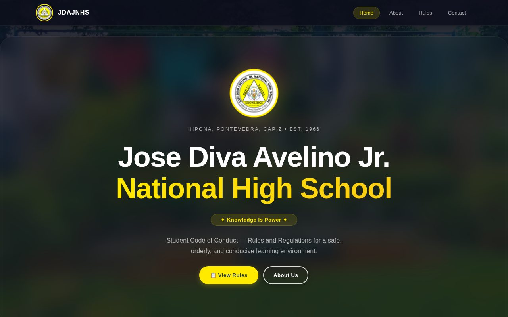
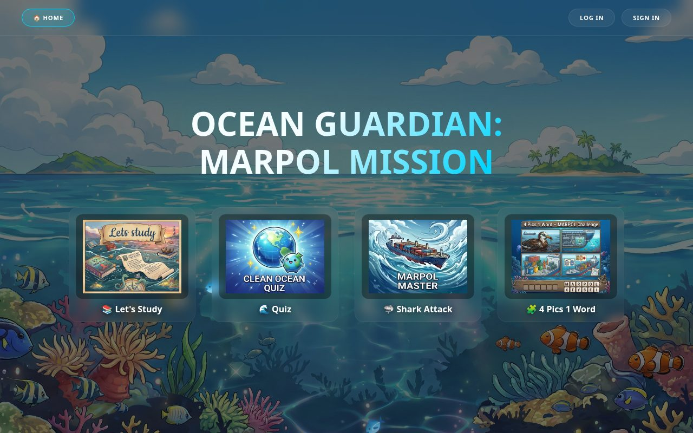

# Tommy Paolma — Computer Engineering Portfolio

Personal portfolio website of **Tommy Paolma**, a Computer Engineering student and aspiring
software engineer. A single-page React application documenting projects, skills, education,
activity, certifications, a printable resume, and contact details.

**Live:** <https://tommy-paolma-cpe-portfolio.vercel.app/>

---

## About

Tommy Paolma is a Computer Engineering student working toward becoming a software engineer.
The portfolio describes the work that is actually documented in this repository:

- An interactive operating-systems learning platform, **Windows vs Linux Academy** (Next.js,
  static export, deployed) — built and deployed as sole developer.
- A school rules and information website, **JDAJNSH**, built with a team as consultant and
  software developer.
- **MARPOL Ocean Adventure**, an educational marine-awareness site with playable browser games.
- Seven event-management web apps on Google Apps Script (registrations, merchandise orders,
  venue navigation, committee rating, sports scheduling) built as sole developer and used for
  real events.
- 18 certifications, C Programming competition at ICPEP, and Arduino/programming mentoring.

The site itself is the portfolio: it is built with React and TypeScript, styled with Tailwind
CSS, tested with Playwright across 11 viewports, and deployed to Vercel.

---

## Live Portfolio

<https://tommy-paolma-cpe-portfolio.vercel.app/>

---

## Portfolio Overview

The portfolio is a single page built from composable React sections. Every section is
addressable by an in-page anchor, and the navigation tracks which one is currently in view.

| # | Section | Anchor | Contents |
|---|---------|--------|----------|
| 1 | Home | `#home` | Name, animated role title, summary, primary calls to action, technology chips, CPU-chip portrait |
| 2 | About | `#about` | Background summary, three achievement highlights, pull quote, photo gallery (6 images) |
| 3 | Computer Engineering | `#computer-engineering` | Hardware / CpE / Software diagram and the skill-flow chain |
| 4 | Featured Projects | `#projects` | 3 featured projects with detail cards, 7 further projects, and category filters |
| 5 | Case Study | `#project-windows-linux-academy` | Full Windows vs Linux Academy case study |
| 6 | Technical Skills | `#skills` | 22 skills across 7 groups, plus 11 cloud/DevOps tools marked *currently learning* |
| 7 | Education | `#education` | Bachelor of Science in Computer Engineering (in progress) |
| 8 | Experience & Leadership | `#experience` | ICPEP competition, JDAJNSH team work, event apps, mentoring |
| 9 | Certifications | `#certifications` | 18 certificate cards, each linking to the full image |
| 10 | Resume | `#resume` | On-page resume, downloadable PDF CV, and print / save-as-PDF |
| 11 | Contact | `#contact` | Email link, copy-to-clipboard, validated message form, social links |

A footer with social links and a back-to-top button close the page.

---

## Portfolio Features

Every item below is implemented in this repository.

**Navigation**

- Sticky header with a desktop nav bar and a full-screen mobile navigation dialog.
- Two nav items (About, Resume) have submenus; on mobile these become accordions.
- The active section is highlighted using an `IntersectionObserver` as you scroll.
- `Escape` closes the mobile menu, the backdrop is clickable, and body scroll is locked while
  it is open.
- A "Skip to main content" link is the first focusable element.

**Content**

- Project filtering across 6 categories (All, Web, Game, Registration, Orders, Events &
  Scoring) with an `aria-live` result count.
- 18 certification cards, each opening the full certificate image in a new tab.
- An on-page resume plus `Print / Save as PDF` and a direct PDF download.
- A dark / light theme toggle persisted in `localStorage`, with an inline no-flash
  initialisation script in `index.html` that also honours the system colour preference.

**Contact**

- Client-side validation (name, email format, minimum message length) with inline
  `role="alert"` messages and `aria-invalid`.
- On submit the form composes a `mailto:` link. **There is no backend and nothing is sent to
  a server** — it opens the visitor's own mail client.
- Copy-to-clipboard button for the email address, with a polite live-region confirmation.

**Visual effects**

- Canvas particle field (70 particles, connection lines) — written from scratch, no library.
- CSS/SVG PCB-trace backdrop and CPU-chip portrait in the hero.
- Scroll-reveal transitions via `IntersectionObserver`, and a typing animation for the role
  title.

**Accessibility and quality**

- All animations and the particle field are disabled under `prefers-reduced-motion: reduce`.
- Visible 3px focus outlines, `min-h-11` (44px) touch targets, semantic landmarks, one `h1`,
  and no heading-level skips.
- `npm run build`, `npm run lint`, and `npm run typecheck` all pass cleanly.

---

## Screenshots

### Projects

These are the real captures committed to the repository.

#### Windows vs Linux Academy — home



#### Windows vs Linux Academy — OS comparison



#### Windows vs Linux Academy — CPU scheduling simulator



#### Windows vs Linux Academy — terminal simulator



#### Windows vs Linux Academy — interactive quiz



#### Windows vs Linux Academy — backend roadmap



#### Windows vs Linux Academy — mobile (390px)



#### JDAJNSH school website



#### MARPOL Ocean Adventure



### Portfolio images

| Image | Used for |
|-------|----------|
| `public/images/tommy-paolma.jpg` | Portrait in the hero (CPU-chip visual) |
| `public/images/featured-jdajnsh.jpg` | JDAJNSH project card |
| `public/images/featured-marpol-ocean-adventure.jpg` | MARPOL project card |
| `public/images/wla-*.jpg` | Windows vs Linux Academy case study (7 images) |
| `public/images/*.png` (18 files) | Certification card thumbnails |
| `public/images/tech/` (33 files) | Skill logo marks |

The remaining 7 projects (the Google Apps Script event apps) use externally hosted card
thumbnails on `i.ibb.co`; no local screenshot of those apps is committed to this repository.

### Viewport regression screenshots

A `screenshots/` directory is produced by the Playwright suite and is **git-ignored** (see
`.gitignore`), so it is not embedded above. It is regenerated locally with:

```bash
npm test
```

It writes one full-page capture per Playwright project — `desktop-1024`, `desktop-1280`,
`desktop-1440`, `desktop-1920`, `tablet`, `mobile-small` (320), `mobile-360`, `mobile-375`,
`mobile-390`, `mobile-414`, and `mobile-430`.

---

## Featured Projects

10 projects are listed in total: 3 featured, 7 additional. All are deployed.

### Windows vs Linux Academy

An interactive operating-systems learning platform covering Windows, macOS, and Linux.

**Purpose:** turn operating-system concepts into an interactive learning experience —
comparisons, simulations, a terminal, a quiz, and visual explanations — instead of static
documentation.

**Interactive components (all implemented, all client-side):**

| Component | What it does |
|-----------|--------------|
| Permissions Lab | chmod calculator, symbolic mode, special bits, chown explorer, ACL calculator, umask simulator |
| CPU Scheduling Simulator | FCFS, SJF, SRTF, Round Robin; workload presets; process table; Gantt chart; ready queue; process control blocks; turnaround / waiting / response metrics; play, step, reset, and speed controls |
| Virtual Memory Simulator | FIFO, LRU, and Optimal page replacement with a Belady-anomaly demo, presets, and play/step/reset |
| Filesystem Explorer | Expandable Windows and Linux directory trees with expand-all / collapse |
| System Calls Lab | Interactive `strace` walkthrough with play, step, and restart |
| Terminal Simulator | `ls`, `cd`, `pwd`, `mkdir`, `touch`, `cat`, `tree`, `echo`, `chmod`, `whoami`, `date`, `clear`, `help`; command history; guided debugging challenges |
| Interactive Quiz | Locally generated questions — choose topic, count, difficulty, and question type; multiple-choice and true/false; hints, instant checking, live score |
| Backend Roadmap | 22 stages from programming fundamentals through cloud deployment, with per-category progress tracking |
| Learning Hub | Notes, cheat-sheet download, and PDF export of study material |

**Technology:** Next.js (Pages Router, static export), React, JavaScript, CSS. Deployed on
Vercel.

**Architecture:** statically exported Next.js pages. All application logic — the scheduling
engine, terminal emulator, and quiz generator — runs in the browser.

**Backend:** none. The deployed build is static; the simulations, terminal, and quiz execute
client-side and no external API is called.

**Role:** sole developer — design, build, deploy.

**Live demo:** <https://windows-linux-academy.vercel.app/>

**Source code:** not publicly linked from this portfolio.

#### Desktop


#### Mobile


---

### JDAJNSH

The rules and information website for Jose Diva Avelino Jr. National High School (Hipona,
Pontevedra, Capiz, established 1966) — presenting the school, its "Knowledge Is Power" motto,
and the Student Code of Conduct with dress code, classroom, attendance, and disciplinary
guidelines.

**Purpose:** publish school information and conduct guidelines in a structured, browsable site.

**Technology:** HTML, CSS, JavaScript. Deployed on GitHub Pages.

**Role:** consultant and software developer on a team project.

**Live demo:** <https://toms1010.github.io/JDAJNSH/>

**Source code:** <https://github.com/toms1010/JDAJNSH>


---

### MARPOL Ocean Adventure

"Ocean Guardian: Marpol Mission" — an educational web experience about marine pollution
prevention, combining study resources (PDF documents and video lessons) with playable browser
games.

**Purpose:** marine-pollution awareness through study material plus three playable games.

**Features:** Clean Ocean Quiz, Marpol Master (Shark Attack), 4 Pics 1 Word, and a study
resources section.

**Technology:** HTML, CSS, JavaScript. Deployed on Vercel.

**Role:** not stated in the repository.

**Live demo:** <https://marpol-ocean-adventure.vercel.app/>

**Source code:** not publicly linked from this portfolio.


---

### Event Management Web Apps

Seven Google Apps Script web apps, each built as sole developer and used at real events.

| Project | Purpose | Stated problem → solution |
|---------|---------|---------------------------|
| Battle of Bands Registration | Real-time band entry management and check-in | Manual sign-ups were slow and disorganized → online registration with organized real-time entries |
| Pre-Event Registration | Attendee pre-registration with confirmation and QR codes | Walk-in queues and missing attendee records → pre-registration with email confirmation and QR codes |
| Cap Order Manager | Structured cap ordering with size, quantity, and payment tracking | Tracking sizes, quantities, and payments in chat threads → structured ordering with payment tracking |
| T-Shirt Order System | Merchandise ordering with size, color, and payment tracking | Messy merch orders scattered across messages → ordering with payment tracking |
| Campus Navigation | Interactive venue map with directions and hall info | Attendees getting lost between venues → interactive venue map with directions and hall info |
| Participant Rating | Real-time committee rating with instant score calculation | Slow paper-based judging → real-time committee rating with instant score calculation |
| Sports Event Manager | Centralized schedules, teams, and live scoreboards | Scattered schedules and scores → centralized schedules, teams, and live scoreboards |

**Technology:** Google Apps Script, HTML, CSS, JavaScript — each deployed as a Google Apps
Script web app.

**Role:** sole developer (design, build, deploy) for all seven.

**Source code:** not publicly linked from this portfolio. Further work is referenced via
<https://github.com/toms1010>.

---

## Certifications

18 certifications are listed in the portfolio (`CERTIFICATIONS` in
`src/data/portfolio.ts`). Each has a name, a short description, and a certificate image in
`public/images/`.

| # | Certification | Description |
|---|---------------|-------------|
| 1 | Python Programming | Data analysis & automation |
| 2 | Web Development Fundamentals | HTML, CSS, JavaScript |
| 3 | C# Programming | Fundamentals of C# development |
| 4 | Java Basic Certificate | Core Java concepts |
| 5 | R Basic Certificate | Statistical computing with R |
| 6 | SQL Basic Certificate | Database querying & management |
| 7 | Data Science Certification | Data analysis & mathematical modeling |
| 8 | Cybersecurity Fundamentals | Best practices & principles |
| 9 | Ethical Hacking | Penetration testing & assessment concepts |
| 10 | Cyber Hygiene | Maintaining secure systems |
| 11 | Advanced Technical Training | Comprehensive technical program |
| 12 | System Configuration | Setup & configuration |
| 13 | Basic Hardware | Computer hardware fundamentals |
| 14 | Computer Setup | Configuring computer systems |
| 15 | Aviation Technology | Aviation-related tech systems |
| 16 | Certificate of Cyber | Cyber security fundamentals |
| 17 | Data Visualization Workshop | Visual analytics & dashboards |
| 18 | Google Cloud Fundamentals | Core cloud infrastructure |

**Issuing providers are not documented in the repository** — the certificate images are the
only source, and they are not transcribed here.

---

## Education

**Bachelor of Science in Computer Engineering** — in progress.

Focus: software development, hardware-software integration, and engineering problem-solving.
Coursework and self-study span programming (C, Python, Java, C#), web technologies, databases,
and cybersecurity fundamentals, reinforced by ICPEP competition experience and Arduino
mentoring.

The institution is not named in the repository.

---

## Experience & Leadership

| Area | Detail |
|------|--------|
| Competition | **ICPEP — C Programming.** Live problem-solving and technical Q&A in front of judges. |
| Consultant · Team | **JDAJNSH School Website.** Consultant and software developer on a team-built rules and information website. |
| Developer · Real events | **Event Management Web Apps.** Designed, built, and deployed 7 live web apps for registrations, merchandise orders, venue navigation, scoring, and sports scheduling. |
| Mentor | **Arduino & Programming Workshops.** Mentored fellow students in Arduino basics and programming fundamentals. |

No employers, dates, or job titles are documented in the repository.

---

## Technical Skills

Listed skills are evidence-based: each carries either a certification, coursework, or a
shipped project. No proficiency percentages are claimed.

| Group | Skills |
|-------|--------|
| Languages | C *(ICPEP competition)*, C++ *(Arduino / embedded)*, C# *(certified)*, Java *(certified)*, JavaScript *(shipped web apps)*, TypeScript, Go, Rust |
| Web Development | HTML *(certified + shipped)*, CSS *(certified + shipped)*, React |
| Backend & Frameworks | .NET, Node.js, npm |
| Databases | MongoDB, MySQL, Neon |
| Mobile & Desktop | Android, Electron |
| Game Development | Godot |
| Tools & Data | Git *(used)*, JSON |

### Currently learning

Shown separately as a learning path, not claimed expertise.

| Group | Tools |
|-------|-------|
| Cloud Platforms | AWS, Microsoft Azure, Google Cloud, Firebase, Heroku |
| DevOps / Infrastructure | Docker, Terraform, Ansible |
| Developer Platforms | GitHub, GitLab, Bitbucket |

---

## Portfolio Technology

The technologies used to build **this** portfolio, as detected in the source:

| Area | Technology |
|------|------------|
| UI library | React 19 + React DOM 19 |
| Language | TypeScript 5.9 (strict mode) |
| Build tool | Vite 8 |
| Styling | Tailwind CSS 4 via `@tailwindcss/vite`, plus a small custom stylesheet in `src/index.css` |
| Icons | `lucide-react` (the only runtime dependency) |
| Font | Inter, loaded from Google Fonts |
| Testing | Playwright (`@playwright/test`) across 11 viewport projects |
| Linting | ESLint 10 + typescript-eslint + eslint-plugin-react-hooks |
| Formatting | Prettier 3 |
| Deployment | Vercel |

**No CSS or JavaScript framework, particle library, icon font, or carousel library is used.**
The particle background, circuit backdrop, CPU visual, reveal animations, typing effect, and
screenshot galleries are all hand-written.

Production build output:

```
dist/index.html                   2.95 kB │ gzip:   1.06 kB
dist/assets/index-*.css          40.53 kB │ gzip:   7.94 kB
dist/assets/index-*.js          328.84 kB │ gzip:  98.58 kB
```

---

## Project Structure

```
Tommy-Paolma-CpE-Portfolio/
├── index.html                  Entry HTML — meta tags, JSON-LD, no-flash theme script
├── package.json                Scripts and dependencies
├── vite.config.ts              Vite + Tailwind plugin; relative `base: './'`
├── tsconfig*.json              TypeScript project references
├── eslint.config.js            ESLint flat config
├── .prettierrc                 Formatting rules
├── playwright.config.ts        11 viewport projects; runs against `vite preview`
│
├── public/                     Copied verbatim into the build
│   ├── favicon.svg
│   ├── robots.txt
│   ├── sitemap.xml
│   ├── Tommy-Paolma-CV.pdf     Downloadable CV
│   └── images/
│       ├── tommy-paolma.jpg    Portrait
│       ├── wla-*.jpg           7 Windows vs Linux Academy captures
│       ├── featured-*.jpg      2 featured project thumbnails
│       ├── *.png               18 certificate images
│       └── tech/               33 technology logo marks
│
├── src/
│   ├── main.tsx                React root; throws if #root is missing
│   ├── App.tsx                 Section composition and skip link
│   ├── index.css               Tailwind import, theme tokens, custom components
│   ├── components/             20 components (one per section plus shared pieces)
│   ├── data/portfolio.ts       All content: projects, skills, certifications, timeline
│   ├── hooks/                  useReveal, useTyping
│   ├── lib/asset.ts            Vite-base-aware public path helper
│   ├── theme/                  ThemeContext, provider, useTheme hook
│   └── types/portfolio.ts      Shared TypeScript types
│
├── tests/
│   ├── fixture.ts              Fresh-context fixture per test
│   └── responsive.spec.ts      14 responsive/a11y/content tests
│
├── screenshots/                Git-ignored Playwright capture output
└── .vercel/                    Git-ignored Vercel project link (repo.json)
```

`vite.config.ts` uses a relative `base: './'`, so the same build works at a domain root
(Vercel) and under a project subpath (GitHub Pages).

---

## Local Development

Requires Node.js `^20.19.0 || >=22.12.0`.

```bash
npm install     # install dependencies
npm run dev     # start the dev server (Vite, with hot reload)
```

Then open the local URL Vite prints (by default <http://localhost:5173>).

### Available scripts

| Command | What it does |
|---------|--------------|
| `npm run dev` | Vite dev server |
| `npm run build` | Type-check, then build to `dist/` |
| `npm run preview` | Serve the production build locally |
| `npm run typecheck` | `tsc -b` |
| `npm run lint` / `lint:fix` | ESLint |
| `npm run format` / `format:check` | Prettier |
| `npm test` | Full Playwright suite (all 11 viewports) |
| `npm run test:mobile` | Mobile viewports only (320, 360, 375, 390, 414, 430) |
| `npm run test:tablet` | Tablet viewport (768) |
| `npm run test:desktop` | Desktop viewports (1024, 1280, 1440, 1920) |
| `npm run test:report` | Open the last Playwright HTML report |

The test suite builds and serves `dist/` via `vite preview`, so run `npm run build` before
`npm test` on a clean checkout.

### Tested viewports

The suite covers **320, 360, 375, 390, 414, 430, 768, 1024, 1280, 1440, and 1920** pixels
wide, and asserts: correct title, no horizontal overflow, all sections render, navigation
reaches every section, the mobile menu opens and closes, project filtering, CV download
target, the contact `mailto:` address, featured-project links, the Academy case study, form
validation, theme persistence, and no console errors.

---

## Deployment

The portfolio is deployed on **Vercel**.

Live: <https://tommy-paolma-cpe-portfolio.vercel.app/>

`.vercel/repo.json` links the directory to the Vercel project
`tommy-paolma-cpe-portfolio`. Vercel runs `npm run build` and publishes `dist/`. Because
`vite.config.ts` sets a relative `base`, the output is host-agnostic.

The deployed `robots.txt` and `sitemap.xml` point at the Vercel URL.

---

## SEO

- Descriptive `<title>` and meta description, `theme-color`, `robots`, and `author` tags.
- `canonical` URL, Open Graph tags (including `og:image` with dimensions and alt text), and
  Twitter card tags.
- `favicon.svg`, plus `robots.txt` and `sitemap.xml` in `public/`.
- `Person` structured data (JSON-LD) embedded in `index.html` — name, email, description,
  topics, and `sameAs` links to the social profiles.
- One `<h1>`, no heading-level skips, descriptive `alt` text on all images, and `aria-labelledby`
  on every section.

---

## Contact

| Channel | Link |
|---------|------|
| Email | [tpaolma@gmail.com](mailto:tpaolma@gmail.com) |
| GitHub | <https://github.com/toms1010> |
| LinkedIn | <https://www.linkedin.com/in/tommy-paolma-65663b341/> |
| X (Twitter) | <https://x.com/TPaolma88394> |
| Facebook | <https://web.facebook.com/tommy.b.paolma> |

Open to internships, OJT opportunities, collaborations, and technical conversations.

---

## Notes

**Accuracy**

- Every project, technology, certification, and role listed above comes from
  `src/data/portfolio.ts`, `src/components/Resume.tsx`, and the certificate images. Nothing
  has been inferred.
- The portfolio's contact form is intentionally backend-free: it validates input and opens the
  visitor's email client via `mailto:`. It does not send mail from a server.
- The Windows vs Linux Academy case study states its own backend as "none detected". That is
  accurate — the deployment is a static Next.js export, and the simulators, terminal, and quiz
  run in the browser. The "Backend Roadmap" on that site is learning *content*, not an existing
  backend.
- Employers, job titles, dates, and certification issuing bodies are not documented in this
  repository and are therefore omitted rather than guessed.

**Architecture choice**

The portfolio is intentionally a Vite + React + TypeScript single-page application rather than
static HTML. The build output is still a plain static site (`index.html`, one CSS file, one JS
file), so it needs no server, but React is what makes the project filtering, theme toggle,
mobile dialog, reveal animations, and typing effect straightforward and testable.

**Not committed**

- `screenshots/` — regenerated by the Playwright suite, git-ignored.
- `.vercel/` — local Vercel project link, git-ignored.
- `.env.local` — contains a Vercel OIDC token; git-ignored and never committed. It is a local
  CLI credential only and is not used by the site at runtime.
