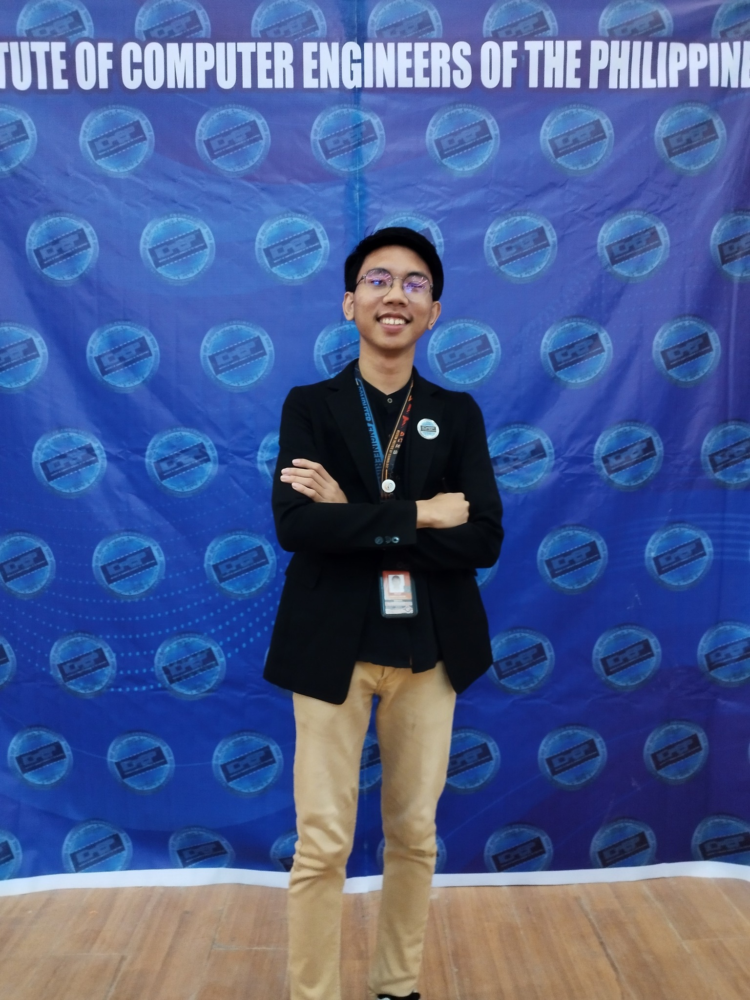
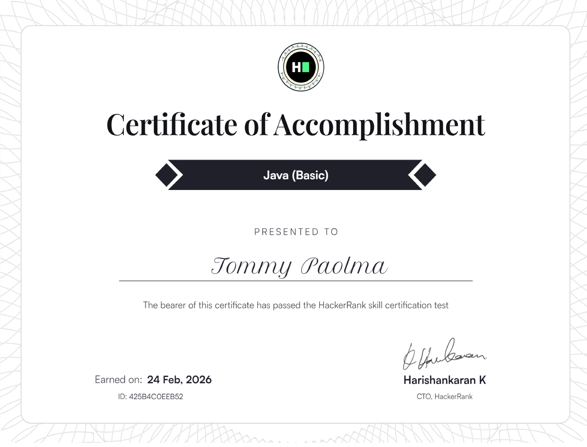

# Tommy Paolma — Computer Engineering Portfolio

> **Read this first.** This file documents the **actual** implementation, verified
> by reading the source and by running the build, linter, and Playwright suite.
> Where something is not implemented, it says so rather than describing it as if
> it were.
>
> | | |
> |---|---|
> | Live site | <https://tommy-paolma-cpe-portfolio.vercel.app/> |
> | Framework | React 19 — single-page app, in-page anchor navigation. No router |
> | Language | TypeScript 5.9, `strict: true`, plus a small hand-written stylesheet |
> | Build | Vite 8 + Tailwind CSS 4. Output is a plain static site in `dist/` |
> | Runtime deps | `lucide-react` only — **one** dependency |
> | Tests | Playwright, 14 specs × 11 viewport projects (320 → 1920 px) |
> | Quality gates | `npm run build`, `npm run lint`, `npm run typecheck` — all clean |
> | Backend | **None.** The contact form composes a `mailto:` link; nothing is sent to a server |
> | Screenshots | Real captures committed under `public/images/`. Captured at their real pixel size and displayed small below |

---

## Screenshots

Every image below is a real file committed to this repository.

The Windows vs Linux Academy captures are **full-page** screenshots, so their
native aspect ratios are very tall. They are scaled to a uniform *height* rather
than a uniform width, which keeps each thumbnail a sensible size and the grid
even. Click any image for the full-resolution original.

### Windows vs Linux Academy — desktop

| Home | CPU scheduling | Terminal |
|---|---|---|
|  |  |  |

| OS comparison | Backend roadmap |
|---|---|
|  |  |

| Quiz |
|---|
|  |

*Native sizes: 1280 × 2514 · 1280 × 2469 · 1280 × 1999 · 1280 × 2955 · 1280 × 3836 · 1280 × 916.*

### Windows vs Linux Academy — mobile

A real capture at a 390 px viewport. It is a full-page shot, so it is
proportionally very tall.


*Native size: 390 × 4140.*

### Other projects

Both are 1280 × 800 viewport captures.

| JDAJNSH | MARPOL Ocean Adventure |
|---|---|
|  |  |

The other seven projects use externally hosted card thumbnails on `i.ibb.co` —
no local screenshot of those apps is committed to this repository, so none is
shown here rather than a placeholder being invented.

### Portfolio imagery

| Hero portrait | Certificate sample | Skill marks |
|---|---|---|
|  |  |  |

### Viewport regression captures

A `screenshots/` directory is produced by the Playwright suite and is
**git-ignored** (see `.gitignore`), so it is not embedded above — it is
regenerated with `npm test`. It writes one full-page capture per viewport project:
`desktop-1024`, `desktop-1280`, `desktop-1440`, `desktop-1920`, `tablet`,
`mobile-small` (320), `mobile-360`, `mobile-375`, `mobile-390`, `mobile-414`, and
`mobile-430`.

---

## About

Tommy Paolma is a Computer Engineering student working toward becoming a
software engineer. The work documented in this repository:

- **Windows vs Linux Academy** — an interactive operating-systems learning
  platform (Next.js, static export, deployed). Sole developer.
- **JDAJNSH** — a school rules and information website, built with a team as
  consultant and software developer.
- **MARPOL Ocean Adventure** — an educational marine-awareness site with playable
  browser games.
- **7 event-management web apps** on Google Apps Script — registrations,
  merchandise orders, venue navigation, committee rating, sports scheduling.
  Sole developer, used at real events.
- **18 certifications**, C Programming competition at ICPEP, and
  Arduino/programming mentoring.

The site itself is part of the portfolio: React and TypeScript, Tailwind CSS,
tested with Playwright across 11 viewports, deployed to Vercel.

---

## Live Portfolio

<https://tommy-paolma-cpe-portfolio.vercel.app/>

---

## Portfolio Overview

One page composed of React sections. Each is addressable by an in-page anchor,
and the navigation tracks which is currently in view.

| # | Section | Anchor | Contents |
|---|---------|--------|----------|
| 1 | Home | `#home` | Name, animated role title, summary, calls to action, tech chips, CPU-chip portrait |
| 2 | About | `#about` | Background, 3 achievement highlights, pull quote, 6-image gallery |
| 3 | Computer Engineering | `#computer-engineering` | Hardware / CpE / Software diagram, skill-flow chain |
| 4 | Featured Projects | `#projects` | 3 featured projects, 7 more, 6 category filters |
| 5 | Case Study | `#project-windows-linux-academy` | Full Windows vs Linux Academy case study |
| 6 | Technical Skills | `#skills` | 22 skills / 7 groups + 11 tools marked *currently learning* |
| 7 | Education | `#education` | BSc Computer Engineering (in progress) |
| 8 | Experience & Leadership | `#experience` | ICPEP, JDAJNSH team work, event apps, mentoring |
| 9 | Certifications | `#certifications` | 18 certificate cards, each linking to the full image |
| 10 | Resume | `#resume` | On-page resume, PDF download, print / save-as-PDF |
| 11 | Contact | `#contact` | Email, copy-to-clipboard, validated form, social links |

A footer and a back-to-top button close the page.

---

## Features

Implemented and verified in this repository:

| Feature | Status | Where |
|---|---|---|
| Sticky header, desktop nav + full-screen mobile dialog | working | `components/Navbar.tsx` |
| Submenus on desktop; accordions on mobile | working | `Navbar.tsx` |
| Active-section highlighting via `IntersectionObserver` | working | `Navbar.tsx` |
| `Escape` to close, backdrop click, body scroll lock | working | `Navbar.tsx` |
| Skip-to-main-content link | working | `App.tsx` |
| Project filtering, 6 categories, `aria-live` count | working | `components/Projects.tsx` |
| 18 certification cards → full image | working | `components/Certifications.tsx` |
| On-page resume + `window.print()` + PDF download | working | `components/Resume.tsx` |
| Dark / light theme, `localStorage`, system-preference default | working | `theme/`, `index.html` |
| No-flash theme init (inline, pre-paint) | working | `index.html` |
| Contact validation, `aria-invalid`, `role="alert"` | working | `components/Contact.tsx` |
| `mailto:` compose + copy-to-clipboard | working | `Contact.tsx` |
| Canvas particle field, hand-written, no library | working | `components/ParticleField.tsx` |
| CSS/SVG circuit backdrop + CPU-chip portrait | working | `CircuitBackdrop.tsx`, `CpuVisual.tsx` |
| Scroll reveals, typing effect | working | `hooks/useReveal.ts`, `hooks/useTyping.ts` |
| `prefers-reduced-motion` disables all motion + particles | working | `index.css`, `useReveal`, `useTyping` |
| Responsive 320 → 1920 px, no horizontal overflow | working | `tests/responsive.spec.ts` |
| Playwright suite across 11 viewport projects | working | `playwright.config.ts` |

**Not implemented** — deliberately, not aspirationally:

| Capability | Why |
|---|---|
| Client-side routing / multiple pages | one page with anchors; no router is installed |
| Search across the portfolio | no search UI exists |
| A contact backend or server | the form is `mailto:` only, by design |
| Project analytics, blog, or news feed | not built |
| Progressive Web App / offline support | no service worker |
| Analytics or tracking scripts | none, deliberately |
| Dark/light sync across devices | `localStorage` is per-browser |
| Test coverage for light mode specifically | theme persistence is tested; both themes are not rendered per-viewport |

---

## Featured Projects

10 projects are listed: 3 featured, 7 additional. All are deployed.

### Windows vs Linux Academy

An interactive operating-systems learning platform covering Windows, macOS, and
Linux.

**Purpose:** turn operating-system concepts into an interactive learning
experience — comparisons, simulations, a terminal, a quiz, and visual
explanations — instead of static documentation.

**Interactive components** — all implemented, all client-side:

| Component | What it does |
|---|---|
| Permissions Lab | chmod calculator, symbolic mode, special bits, chown explorer, ACL calculator, umask simulator |
| CPU Scheduling Simulator | FCFS, SJF, SRTF, Round Robin; presets; process table; Gantt chart; ready queue; process control blocks; turnaround / waiting / response metrics; play, step, reset, speed |
| Virtual Memory Simulator | FIFO, LRU, Optimal page replacement, Belady demo, presets, play / step / reset |
| Filesystem Explorer | Expandable Windows and Linux directory trees, expand-all / collapse |
| System Calls Lab | Interactive `strace` walkthrough with play, step, restart |
| Terminal Simulator | `ls`, `cd`, `pwd`, `mkdir`, `touch`, `cat`, `tree`, `echo`, `chmod`, `whoami`, `date`, `clear`, `help`; command history; guided challenges |
| Interactive Quiz | Locally generated questions — topic, count, difficulty, type; multiple-choice and true/false; hints, instant checking, live score |
| Backend Roadmap | 22 stages, fundamentals → cloud, with per-category progress |
| Learning Hub | Notes, cheat-sheet download, PDF export of study material |

| | |
|---|---|
| **Technology** | Next.js (Pages Router, static export), React, JavaScript, CSS |
| **Architecture** | Statically exported Next.js pages; all logic — scheduling engine, terminal, quiz generator — runs in the browser |
| **Backend** | **None.** The build is static; no external API is called at runtime |
| **Role** | Sole developer — design, build, deploy |
| **Live demo** | <https://windows-linux-academy.vercel.app/> |
| **Source code** | Not publicly linked from this portfolio |

> The "Backend Roadmap" on that site is **learning content**, not an existing
> backend. The deployment is a static export with no server or database.

| Desktop | Mobile |
|---|---|
|  |  |

---

### JDAJNSH

The rules and information website for Jose Diva Avelino Jr. National High School
(Hipona, Pontevedra, Capiz, established 1966) — the school, its "Knowledge Is
Power" motto, and the Student Code of Conduct with dress code, classroom,
attendance, and disciplinary guidelines.

| | |
|---|---|
| **Purpose** | Publish school information and conduct guidelines in a structured, browsable site |
| **Technology** | HTML, CSS, JavaScript — deployed on GitHub Pages |
| **Role** | Consultant and software developer, team project |
| **Live demo** | <https://toms1010.github.io/JDAJNSH/> |
| **Source code** | <https://github.com/toms1010/JDAJNSH> |


---

### MARPOL Ocean Adventure

"Ocean Guardian: Marpol Mission" — marine-pollution awareness combining study
resources (PDFs and video lessons) with playable browser games.

| | |
|---|---|
| **Purpose** | Marine-pollution awareness through study material plus three playable games |
| **Features** | Clean Ocean Quiz, Marpol Master (Shark Attack), 4 Pics 1 Word, study resources |
| **Technology** | HTML, CSS, JavaScript — deployed on Vercel |
| **Role** | Not stated in the repository |
| **Live demo** | <https://marpol-ocean-adventure.vercel.app/> |
| **Source code** | Not publicly linked from this portfolio |


---

### Event Management Web Apps

Seven Google Apps Script web apps, each built as sole developer and used at real
events.

| Project | Purpose | Problem → solution |
|---|---|---|
| Battle of Bands Registration | Real-time band entry management and check-in | Manual sign-ups slow and disorganized → online registration with organized real-time entries |
| Pre-Event Registration | Pre-registration with confirmation and QR codes | Walk-in queues, missing records → pre-registration with email confirmation and QR codes |
| Cap Order Manager | Cap ordering with size, quantity, payment tracking | Sizes/quantities/payments tracked in chat → structured ordering with payment tracking |
| T-Shirt Order System | Merchandise ordering with size, color, payment tracking | Messy merch orders across messages → ordering with payment tracking |
| Campus Navigation | Interactive venue map with directions and hall info | Attendees lost between venues → interactive venue map with directions and hall info |
| Participant Rating | Real-time committee rating, instant score calculation | Slow paper-based judging → real-time rating with instant score calculation |
| Sports Event Manager | Centralized schedules, teams, live scoreboards | Scattered schedules and scores → centralized schedules, teams, scoreboards |

| | |
|---|---|
| **Technology** | Google Apps Script, HTML, CSS, JavaScript — deployed as Apps Script web apps |
| **Role** | Sole developer (design, build, deploy) for all seven |
| **Source code** | Not publicly linked. Further work: <https://github.com/toms1010> |

---

## Certifications

18 certifications, from `CERTIFICATIONS` in `src/data/portfolio.ts`. Each has a
name, a description, and a certificate image in `public/images/`.

| # | Certification | Description |
|---|---|---|
| 1 | Python Programming | Data analysis & automation |
| 2 | Web Development Fundamentals | HTML, CSS, JavaScript |
| 3 | C# Programming | Fundamentals of C# development |
| 4 | Java Basic Certificate | Core Java concepts |
| 5 | R Basic Certificate | Statistical computing with R |
| 6 | SQL Basic Certificate | Database querying & management |
| 7 | Data Science Certification | Data analysis & mathematical modeling |
| 8 | Cybersecurity Fundamentals | Best practices & principles |
| 9 | Ethical Hacking | Penetration testing & assessment concepts |
| 10 | Cyber Hygiene | Maintaining secure systems |
| 11 | Advanced Technical Training | Comprehensive technical program |
| 12 | System Configuration | Setup & configuration |
| 13 | Basic Hardware | Computer hardware fundamentals |
| 14 | Computer Setup | Configuring computer systems |
| 15 | Aviation Technology | Aviation-related tech systems |
| 16 | Certificate of Cyber | Cyber security fundamentals |
| 17 | Data Visualization Workshop | Visual analytics & dashboards |
| 18 | Google Cloud Fundamentals | Core cloud infrastructure |

**Issuing providers are not documented in the repository** — the certificate
images are the only source and are not transcribed here.

---

## Education

**Bachelor of Science in Computer Engineering** — in progress. Focus: software
development, hardware-software integration, engineering problem-solving.
Coursework and self-study span programming (C, Python, Java, C#), web
technologies, databases, and cybersecurity fundamentals, reinforced by ICPEP
competition experience and Arduino mentoring.

The institution is not named in the repository.

---

## Experience & Leadership

| Area | Detail |
|---|---|
| Competition | **ICPEP — C Programming.** Live problem-solving and technical Q&A before judges. |
| Consultant · Team | **JDAJNSH School Website.** Consultant and software developer on a team-built rules and information site. |
| Developer · Real events | **Event Management Web Apps.** Designed, built, and deployed 7 live apps for registrations, merchandise orders, venue navigation, scoring, and sports scheduling. |
| Mentor | **Arduino & Programming Workshops.** Mentored fellow students in Arduino basics and programming fundamentals. |

No employers, job titles, or dates are documented in the repository.

---

## Technical Skills

Evidence-based: each entry carries a certification, coursework, or a shipped
project. No proficiency percentages are claimed.

| Group | Skills |
|---|---|
| Languages | C *(ICPEP competition)*, C++ *(Arduino / embedded)*, C# *(certified)*, Java *(certified)*, JavaScript *(shipped web apps)*, TypeScript, Go, Rust |
| Web Development | HTML *(certified + shipped)*, CSS *(certified + shipped)*, React |
| Backend & Frameworks | .NET, Node.js, npm |
| Databases | MongoDB, MySQL, Neon |
| Mobile & Desktop | Android, Electron |
| Game Development | Godot |
| Tools & Data | Git *(used)*, JSON |

### Currently learning

Shown separately as a learning path, **not** claimed expertise.

| Group | Tools |
|---|---|
| Cloud Platforms | AWS, Microsoft Azure, Google Cloud, Firebase, Heroku |
| DevOps / Infrastructure | Docker, Terraform, Ansible |
| Developer Platforms | GitHub, GitLab, Bitbucket |

---

## Portfolio Technology

Used to build **this** portfolio, as detected in the source:

| Area | Technology |
|---|---|
| UI library | React 19 + React DOM 19 |
| Language | TypeScript 5.9, `strict: true` |
| Build tool | Vite 8 |
| Styling | Tailwind CSS 4 via `@tailwindcss/vite` + a custom stylesheet in `src/index.css` |
| Icons | `lucide-react` — the only runtime dependency |
| Font | Inter, from Google Fonts |
| Testing | Playwright (`@playwright/test`), 11 viewport projects |
| Linting | ESLint 10 + typescript-eslint + eslint-plugin-react-hooks |
| Formatting | Prettier 3 |
| Deployment | Vercel |

**No CSS or JS framework, particle library, icon font, or carousel library.** The
particle field, circuit backdrop, CPU visual, reveal animations, and typing
effect are all hand-written.

Production build:

```
dist/index.html                   2.95 kB │ gzip:   1.06 kB
dist/assets/index-*.css          40.55 kB │ gzip:   7.95 kB
dist/assets/index-*.js          328.84 kB │ gzip:  98.58 kB
```

---

## Project Structure

```
Tommy-Paolma-CpE-Portfolio/
├── index.html                  Entry HTML — meta, JSON-LD, no-flash theme script
├── package.json                Scripts and dependencies
├── vite.config.ts              Vite + Tailwind; relative `base: './'`
├── tsconfig*.json              TypeScript project references
├── eslint.config.js            ESLint flat config
├── .prettierrc                 Formatting rules
├── playwright.config.ts        11 viewport projects; runs against `vite preview`
│
├── public/                     Copied verbatim into the build
│   ├── favicon.svg
│   ├── robots.txt
│   ├── sitemap.xml
│   ├── Tommy-Paolma-CV.pdf     Downloadable CV
│   └── images/
│       ├── tommy-paolma.jpg    Portrait
│       ├── wla-*.jpg           7 Windows vs Linux Academy captures
│       ├── featured-*.jpg      2 featured project thumbnails
│       ├── *.png               18 certificate images
│       └── tech/               33 technology logo marks
│
├── src/
│   ├── main.tsx                React root; throws if #root is missing
│   ├── App.tsx                 Section composition + skip link
│   ├── index.css               Tailwind import, theme tokens, components
│   ├── components/             20 components
│   ├── data/portfolio.ts       All content: projects, skills, certs, timeline
│   ├── hooks/                  useReveal, useTyping
│   ├── lib/asset.ts            Vite-base-aware public path helper
│   ├── theme/                  ThemeContext, provider, useTheme
│   └── types/portfolio.ts      Shared types
│
├── tests/
│   ├── fixture.ts              Fresh-context fixture per test
│   └── responsive.spec.ts      14 responsive / a11y / content tests
│
├── screenshots/                Git-ignored Playwright capture output
└── .vercel/                    Git-ignored Vercel link (repo.json)
```

`base: './'` is relative, so the same build works at a domain root (Vercel) and
under a project subpath (GitHub Pages).

---

## How to Run

**Requires** Node.js `^20.19.0 || >=22.12.0`.

```bash
npm install     # install dependencies
npm run dev     # dev server with hot reload
```

Then open the URL Vite prints (by default <http://localhost:5173>).

| Command | What it does |
|---|---|
| `npm run dev` | Vite dev server |
| `npm run build` | Type-check, then build to `dist/` |
| `npm run preview` | Serve the production build locally |
| `npm run typecheck` | `tsc -b` |
| `npm run lint` / `lint:fix` | ESLint |
| `npm run format` / `format:check` | Prettier |
| `npm test` | Full Playwright suite, all 11 viewports |
| `npm run test:mobile` | 320, 360, 375, 390, 414, 430 |
| `npm run test:tablet` | 768 |
| `npm run test:desktop` | 1024, 1280, 1440, 1920 |
| `npm run test:report` | Open the last Playwright HTML report |

The suite serves `dist/` via `vite preview`, so run `npm run build` before
`npm test` on a clean checkout.

### How to Test

The 14 specs assert: correct title, no horizontal overflow, all sections render,
navigation reaches every section, the mobile menu opens and closes, project
filtering counts, the CV download target, the contact `mailto:` address,
featured-project links, the Academy case study, form validation, theme
persistence, and no console errors.

Verified viewports: **320, 360, 375, 390, 414, 430, 768, 1024, 1280, 1440, 1920**.

---

## Deployment

Vercel. Live: <https://tommy-paolma-cpe-portfolio.vercel.app/>

`.vercel/repo.json` links the directory to the project
`tommy-paolma-cpe-portfolio`. Vercel runs `npm run build` and publishes `dist/`.
Because `base` is relative, the output is host-agnostic.

---

## SEO

- Descriptive `<title>`, meta description, `theme-color`, `robots`, `author`.
- `canonical` URL, Open Graph tags (with `og:image` dimensions and alt text),
  Twitter card tags.
- `favicon.svg`, `robots.txt`, `sitemap.xml` in `public/`.
- `Person` structured data (JSON-LD) in `index.html` — name, email, description,
  topics, and `sameAs` social links.
- One `<h1>`, no heading-level skips, `alt` on every image, `aria-labelledby` on
  every section.

---

## Contact

| Channel | Link |
|---|---|
| Email | [tpaolma@gmail.com](mailto:tpaolma@gmail.com) |
| GitHub | <https://github.com/toms1010> |
| LinkedIn | <https://www.linkedin.com/in/tommy-paolma-65663b341/> |
| X (Twitter) | <https://x.com/TPaolma88394> |
| Facebook | <https://web.facebook.com/tommy.b.paolma> |

Open to internships, OJT opportunities, collaborations, and technical
conversations.

---

## Notes

**Accuracy**

- Every project, technology, certification, and role above comes from
  `src/data/portfolio.ts`, `src/components/Resume.tsx`, and the certificate
  images. Nothing is inferred.
- The contact form is **intentionally backend-free**: it validates input and
  opens the visitor's email client via `mailto:`. It does not send mail from a
  server.
- The Windows vs Linux Academy case study states its own backend as "none
  detected". That is accurate — the deployment is a static Next.js export and the
  simulators, terminal, and quiz run in the browser.
- Employers, job titles, dates, and certification issuing bodies are not
  documented in this repository, so they are omitted rather than guessed.

**Architecture choice**

The portfolio is a Vite + React + TypeScript SPA rather than static HTML. The
build output is still a plain static site — one HTML file, one CSS file, one JS
file, no server required — but React is what makes the project filtering, theme
toggle, mobile dialog, reveal animations, and typing effect straightforward and
testable.

**Not committed**

- `screenshots/` — regenerated by the Playwright suite, git-ignored.
- `.vercel/` — local Vercel project link, git-ignored.
- `.env.local` — holds a Vercel OIDC token. Git-ignored, never committed, and
  **not used by the site at runtime**; it is a local CLI credential only.
